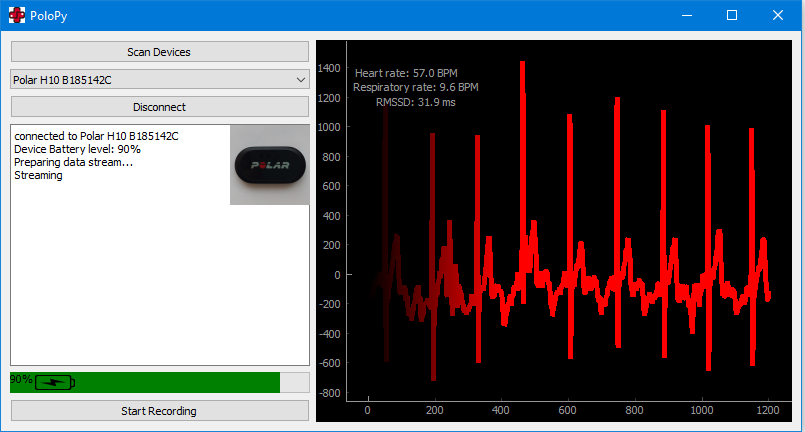
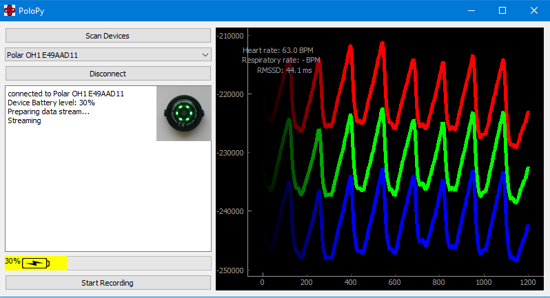

Open Polar wearable data logger API and tools in Python

In this project an open Python API for Polar wearable fittness sensors is implemented. The aim is to provide simple to use tools for logging the wariety of signals Polar wearables are able to produce:
* ECG
* HRV
* HR
* ACC
* PPG 

During my studies on Biomedical engineering I struggled with the fact that all exercises on bisosignal processing were done offline and ways of measuring raw signals were limited. Polar wearables provice somewhat affordable way of measuring these signals. There are a few good mobile apps that enable the logging of the signals to mobile phone, but they do not provide the hands on access on the real time signals and logging. Thus this project aims on creating an API enabling easy to approach way to real time signal processing and analysis. Hopefulluy PoloPy boosts the learning of some future students and maybe it can be of help for some research activities. 

Currently the GUI.py is the most functional script. It implements QT based GUI for connecting to Polar H10 and OH1 and streaming data from them:

The project is under MIT License, so be free to use and modify the code. Just remember to refer to the license accordingly.
Have fun :)
